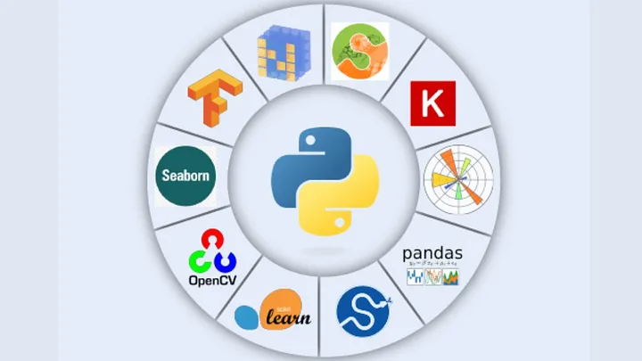

  

<h1 align="center">Data Science Learning Notebooks</h1>

This repo contains educational notebooks about commonly used Python packages in the field of data science and AI.

### Index
| Name | Application  |
| --- | --- |
| [numpy](https://github.com/TheGeekers/Python-Notebooks/tree/main/numpy) | Data manipulation, scientific computing, machine learning, numerical analysis, array operations. |
| [pandas](https://github.com/TheGeekers/Python-Notebooks/tree/main/pandas) | Data analysis, manipulation, cleaning, exploration, visualization, time series analysis, statistics. |
| [scikit-learn](https://github.com/TheGeekers/Python-Notebooks/tree/main/scikit-learn) | Machine learning, classification, regression, clustering, dimensionality reduction, model evaluation, preprocessing. |
| [matplotlib](https://github.com/TheGeekers/Python-Notebooks/tree/main/matplotlib) | Data visualization, plotting, charts, graphs, histograms, scatter plots, customization. |
| [seaborn](https://github.com/TheGeekers/Python-Notebooks/tree/main/seaborn) | Statistical data visualization, enhancement of Matplotlib, attractive visualizations, complex data. |

### Bugs or Opinion
Feel free to let me know if there are any problems or any request you have for this repo.
